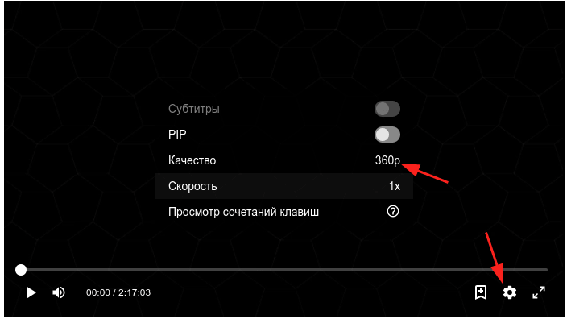
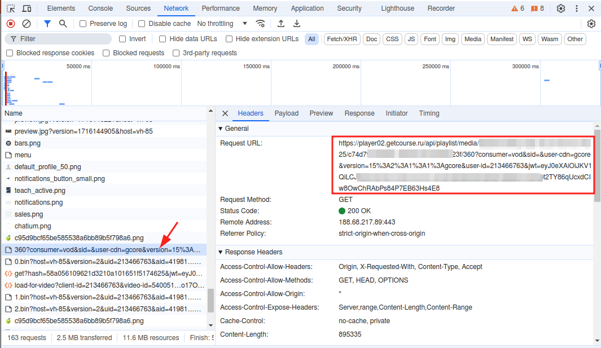
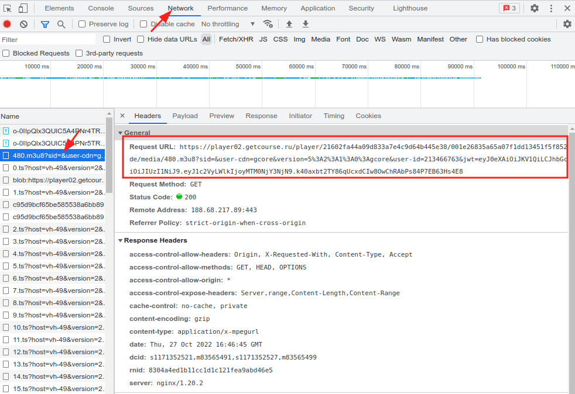
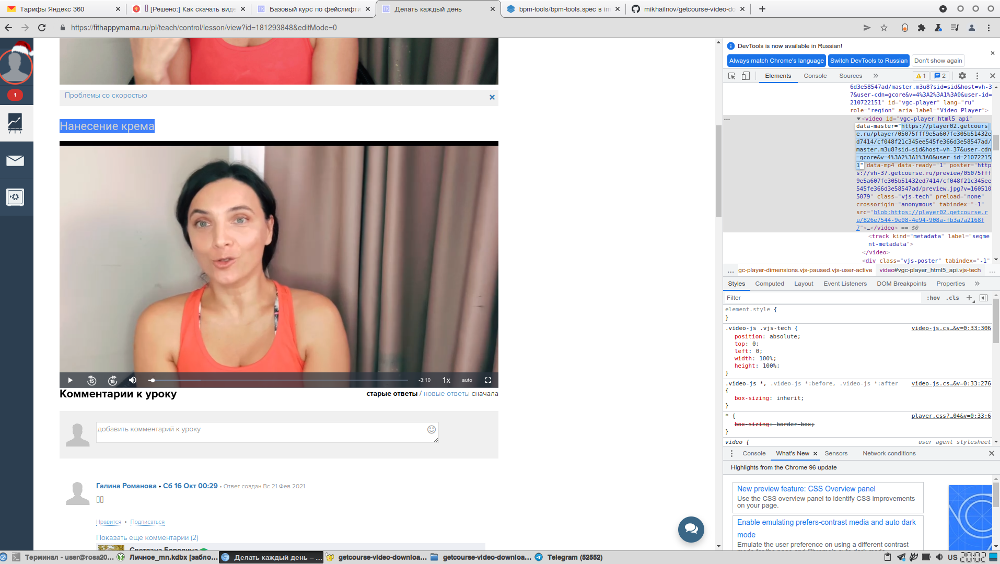
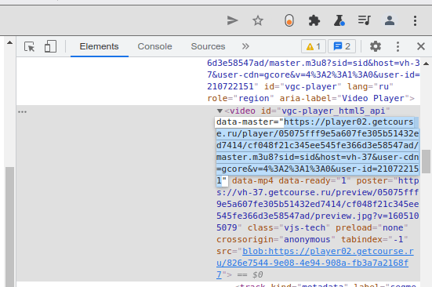

# Скрипт для скачивания видео с GetCourse без перекодирования

## Введение

Некоторые [инструкции в интернете](https://www.nibbl.ru/poleznye-sovety/kak-skachat-video-s-getkursa-getcourse.html) предлагают скачивать видео с GetCourse с помощью VLC, однако это требует перекодирования видео.

Этот скрипт скачивает видео-уроки с Геткурса без перекодирования. Работает на Linux, BSD, macOS и в др. UNIX-подобных окружениях.

## Реализации

| Файл | Язык | Описание | Зависимости |
|---|---|---|---|
| `getcourse-video-downloader.sh` | Bash | Последовательное скачивание | `bash`, `curl`, `grep`, `coreutils` |
| `getcourse-video-speed.sh` | Bash | Параллельное скачивание с прогресс-баром | + `parallel`, `pv` |
| `getcourse-video-downloader.go` | Go | Параллельное скачивание, без доп. зависимостей | Go ≥ 1.16 |

## Как достать ссылку на видео

GetCourse иногда меняет алгоритмы, ниже описано 2 способа, как достать ссылку на видео. Если вы считаете, что GetCourse снова изменил алгоритмы, сообщите об этом в [issues](https://github.com/mikhailnov/getcourse-video-downloader/issues).

### Способ 1

* Откройте страницу с видео в браузере Chromium / Google Chrome
* Нажмите правой правой кнопкой мыши на видео, выберите "Просмотреть код"
* В открывшейся панели разработчиков откройте вкладку "Network"
* Перезагрузите страницу в браузере
* Выберите нужное разрешение видео в настройках видеоплеера GetCourse
* Запустите проигрывание видео, дайте проиграться около секунды и поставьте на паузу
* Найдите и скопируйте ссылку ("Request URL") на скачанный файл с именем в виде числа, совпадающего с разрешением видео в плеере (360, 720, 1080 и т.д.)





Если такого файла нет, то поищите файл `*.m3u8`:



### Способ 2

* Откройте страницу с видео в браузере Chromium / Google Chrome
* Нажмите правой правой кнопкой мыши на видео, выберите "Просмотреть код"
* В открывшемся коде найдите: `<video id="vgc-player_html5_api" data-master="ДЛИННАЯ_ССЫЛКА"`
* Скопируйте эту ссылку (ДЛИННАЯ_ССЫЛКА)




## Запуск

### Bash (последовательное скачивание)

```bash
curl -L --output /tmp/getcourse-video-downloader.sh \
  https://github.com/mikhailnov/getcourse-video-downloader/raw/master/getcourse-video-downloader.sh

bash /tmp/getcourse-video-downloader.sh "ДЛИННАЯ_ССЫЛКА" "Имя файла.ts"
```

### Bash (параллельное скачивание с прогресс-баром)

Требует `parallel` и `pv` (`sudo apt install parallel pv` / `brew install parallel pv`).

```bash
curl -L --output /tmp/getcourse-video-speed.sh \
  https://github.com/mikhailnov/getcourse-video-downloader/raw/master/getcourse-video-speed.sh

bash /tmp/getcourse-video-speed.sh "ДЛИННАЯ_ССЫЛКА" "Имя файла.ts"

# Количество потоков (по умолчанию 4):
PP=8 bash /tmp/getcourse-video-speed.sh "ДЛИННАЯ_ССЫЛКА" "Имя файла.ts"
```

### Go

Требует установленного [Go](https://go.dev/dl/) версии 1.16 или выше.

```bash
# Запустить напрямую:
go run getcourse-video-downloader.go "ДЛИННАЯ_ССЫЛКА" "Имя файла.ts"

# Или собрать бинарный файл:
make build
./getcourse-video-downloader "ДЛИННАЯ_ССЫЛКА" "Имя файла.ts"

# Количество потоков (по умолчанию 4):
PP=8 ./getcourse-video-downloader "ДЛИННАЯ_ССЫЛКА" "Имя файла.ts"
```

### ROSA Linux

```bash
sudo dnf install getcourse-video-downloader
getcourse-video-downloader "ДЛИННАЯ_ССЫЛКА" "Имя файла.ts"
```

Первым аргументом идет ссылка, вторым — имя файла, куда сохранить скачанное, рекомендуемое расширение — ts.

## Другие реализации
* [GetCoursePythonDownloader](https://github.com/snhplayer/GetCoursePythonDownloader)
